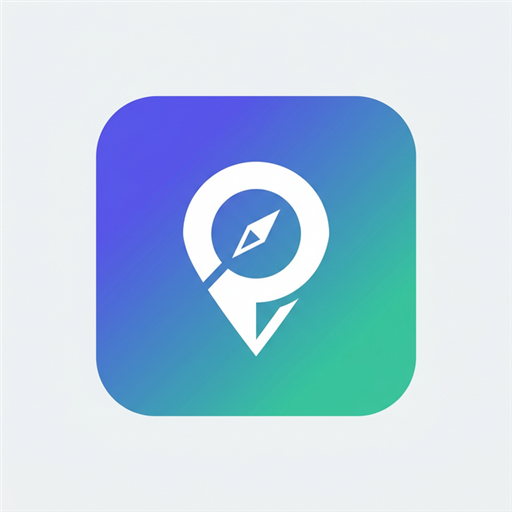

# 🏫 CampusLens — Indoor Navigation

<p align="center">
  
</p>

<p align="center">
  <b>A lightweight, offline-first PWA for navigating Rajagiri College's KE Block</b><br/>
  QR-based positioning · Turn-by-turn directions · Admin panel · Zero dependencies
</p>

<p align="center">
  
  
  
  
</p>

---

## ✨ Features

- 🗺️ **Interactive Floor Map** — Pan, zoom, and explore the KE Block floor plan
- 📍 **QR-Based Positioning** — Scan room QR codes to set your current location instantly
- 🧭 **Turn-by-Turn Navigation** — A* pathfinding with step-by-step directions
- 📡 **Dead Reckoning** — Sensor-based position tracking between QR scans
- 🔒 **Admin Panel** — Manage rooms, QR codes, and events with a protected login
- 📅 **Events Board** — Browse and manage campus events
- 📱 **PWA / Installable** — Works on any device, installable like a native app
- ⚡ **Zero Dependencies** — Single HTML file, no build tools, no frameworks

---

## 🚀 Live Demo

> **[👉 Try it on GitHub Pages](https://hariprasad.github.io/CampusLens/)**  
> *(update this link after enabling GitHub Pages)*

**Demo credentials:**
| Role | Username | Password |
|------|----------|----------|
| Admin | `admin@rajagiri.edu` | `admin123` |
| User | Any name | — |

---

## 📁 Project Structure

```
CampusLens/
├── index.html       # Entire app — map, nav, admin, PWA logic
├── icon-512.png     # App icon (PWA + favicon)
├── combine.py       # Dev utility to combine source files
└── README.md        # You are here
```

> The entire application ships as a **single `index.html` file** — no server, no build step, no node_modules.

---

## 🛠️ How to Run

### Option 1 — Just open it
```bash
# Download index.html and open directly in any browser
open index.html
```

### Option 2 — Local server (recommended for PWA features)
```bash
# Python
python3 -m http.server 8080

# Node
npx serve .
```
Then visit `http://localhost:8080`

### Option 3 — GitHub Pages (recommended for sharing)
1. Push this repo to GitHub
2. Go to **Settings → Pages → Source → main branch**
3. Your app is live at `https://<your-username>.github.io/<repo-name>/`

---

## 🗺️ How Navigation Works

1. **Scan a QR code** at your current room → sets your start position
2. **Select a destination** from the dropdown
3. **Hit Start Navigation** → A* algorithm finds the shortest path
4. Follow the **turn-by-turn steps** shown below the map
5. Enable **sensors** for **dead-reckoning** position updates between scans

---

## 📱 Installing as an App (PWA)

On mobile:
- **Android (Chrome):** Tap the menu → *Add to Home Screen*
- **iOS (Safari):** Tap Share → *Add to Home Screen*

On desktop:
- Look for the install icon (➕) in the browser address bar

---

## 👨‍💻 Author

**Hariprasad**  
Rajagiri College of Engineering & Technology  
© 2025 — All rights reserved

---

## 📄 License

This project is proprietary. See [LICENSE](LICENSE) for details.  
Unauthorized copying, redistribution, or commercial use is prohibited.
